# Live·En·Synergy — Portal Review Response

**Prepared:** 27 July 2026
**Covers:** *Brand Portal.pdf* (24 July 2026) and *Artist Portal.pdf* (25 July 2026)

---

## About this document

Every point raised in the two review notes is listed below with its current
status and a screenshot of the actual running application. Nothing here is
described from memory or from a specification — each image was captured by an
automated browser session (Playwright/Chromium) signing in as a real Brand
account and a real Artist account and walking the screens in turn.

The suite lives in `tests/` and can be re-run at any time to regenerate this
evidence.

### Status key

| Mark | Meaning |
| --- | --- |
| **Done** | Built, working, and shown in the screenshot |
| **Partial** | Built, but with a stated limitation |
| **Not done** | Not yet built — explained, with what it needs |
| **Answered** | A question in the notes rather than a change request |

### At a glance

| | Brand Portal | Artist Portal | Total |
| --- | --- | --- | --- |
| Done | 14 | 4 | **18** |
| Partial | 2 | 1 | **3** |
| Not done | 2 | 2 | **4** |
| Answered (question, not a change) | — | 1 | **1** |
| **Points covered** | **18** | **8** | **26** |

The per-campaign chatbox appears in both sets of notes and is therefore counted
once in each. Seven questions raised across the two documents are answered in
[Questions answered](#questions-answered).

---

## 1. Brand Portal

### 1.1 Overview

#### B-OV-01 — "Option to see section of confirmed sponsorship as well" — **Done**

The Brand overview now carries a **Confirmed sponsorships** section listing the
deals both parties have agreed, with the remaining budget on each, plus a
headline count in the metric row. Each row links straight through to the
sponsorship.

Following your later note, the same breakdown is now also a dedicated section
inside the **Sponsored events** tab — see [B-SPON-04](#b-spon-04--sponsored-events-grouped-by-status--done).

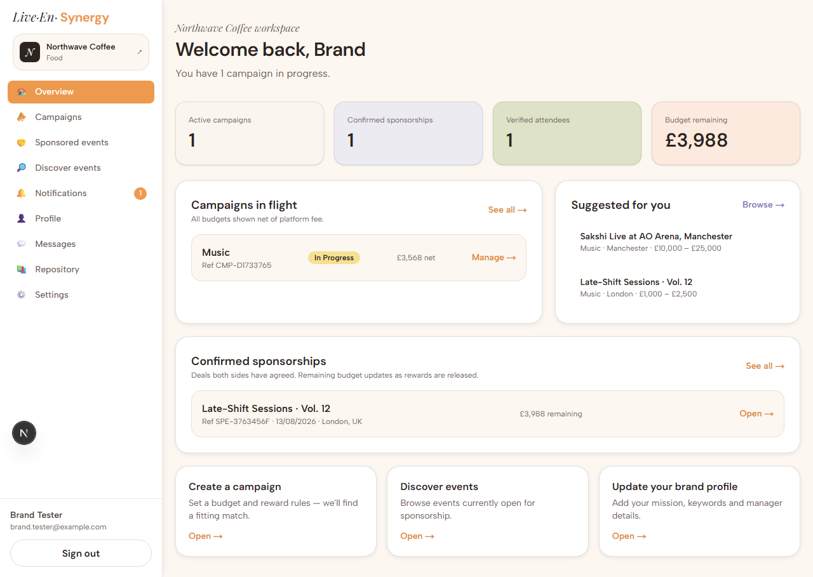

---

### 1.2 Campaign creation

#### B-CAMP-01 — Intro copy + description placeholder — **Done**

"Launch Your Next Partnership" appears above the form with your wording
verbatim, and the description field carries your example placeholder. The intro
shows when creating a campaign and is hidden when editing an existing one, so it
doesn't repeat itself.

---

#### B-CAMP-02 — "Exchange placement of Estimated breakdown and category" — **Done**

The estimated breakdown now sits directly beside the budget field, so the
service fee and the amount available for sponsorship update live as the number
is typed. Category of artist/event has moved below.

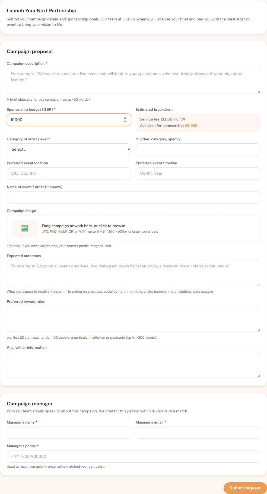

---

#### B-CAMP-03 — Low-budget guard — **Done** *(added after your 27 July note)*

You flagged a £400 budget showing a £378 fee and only £22 available. That figure
is arithmetically correct: the fee is the **higher** of £315 + VAT or 9% + VAT,
and the flat minimum stays higher until the budget reaches **£3,500**. Small
budgets are therefore mostly fee — that is the pricing model working as
specified, not a fault.

Checking it did surface a genuine defect next to it: below £378 the figure went
*negative* and the campaign still saved. The form now refuses these budgets and
explains why, and the same rule is enforced on the server.

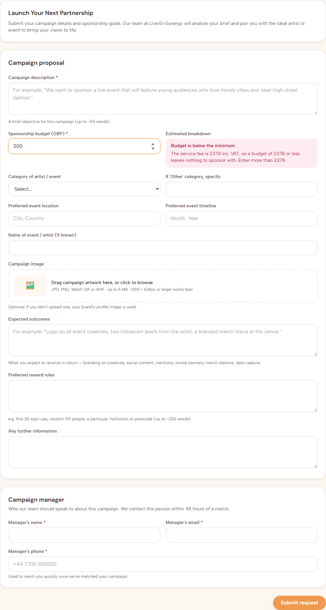

---

#### B-CAMP-04 — "Update sportsperson to sports and add Gaming and Conference" — **Done**

"Sportsperson" is gone. **Sports**, **Gaming** and **Conference** are all
present in the category list.

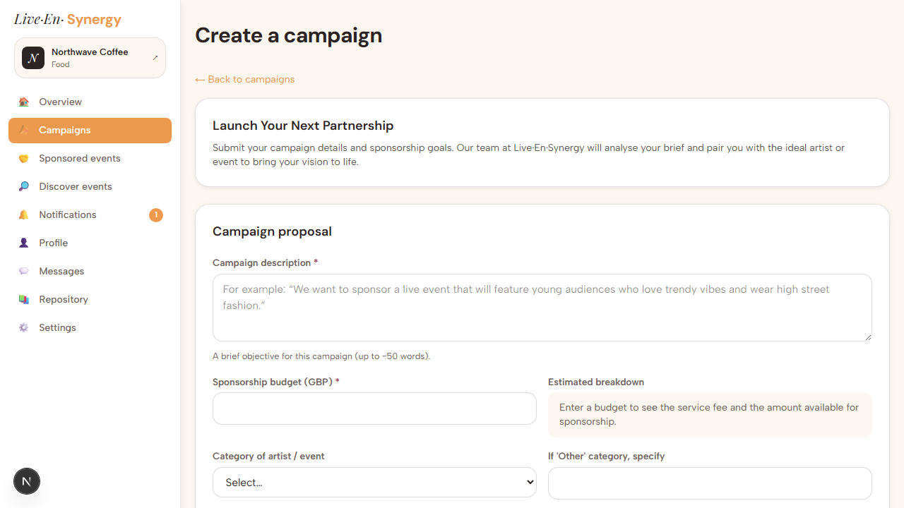

---

#### B-CAMP-05 — Campaign artwork + mandatory manager details — **Partial**

Campaign artwork upload is in place, and all three Campaign Manager fields
(name, email, phone) are now mandatory — enforced both in the browser and on the
server, so they cannot be bypassed.

**Limitation:** the uploaded campaign artwork is stored but is not yet displayed
anywhere a viewer would see it — not on the campaign detail page, nor in the
artist-facing Discover Campaigns browse. The form also states that your brand
profile image will be used when no artwork is uploaded; that fallback is not yet
built. Listed as an outstanding item below.

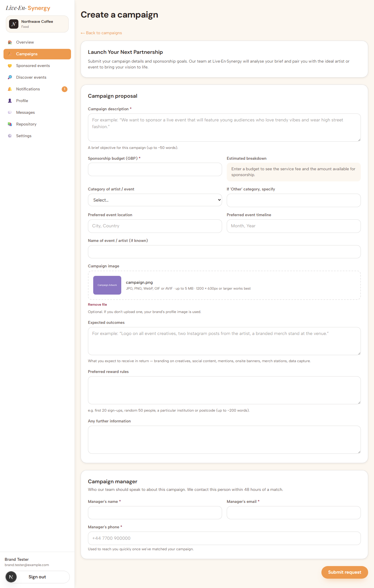

---

### 1.3 Sponsored events — creation

#### B-SPON-01 — Link artist name; autofill from the linked listing — **Done**

A sponsored event can be linked to an event listing, to the artist, and to one
of your own campaigns.

**Before selecting a listing** — fields empty:

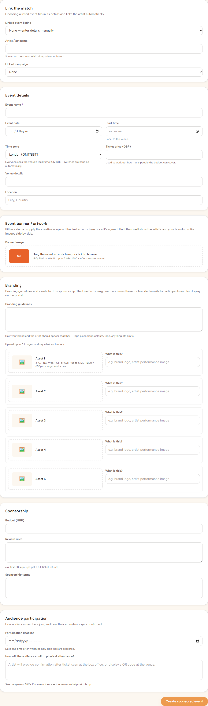

**After selecting a listing** — event name, date, ticket price, venue, location
and the artist's name all fill in automatically:

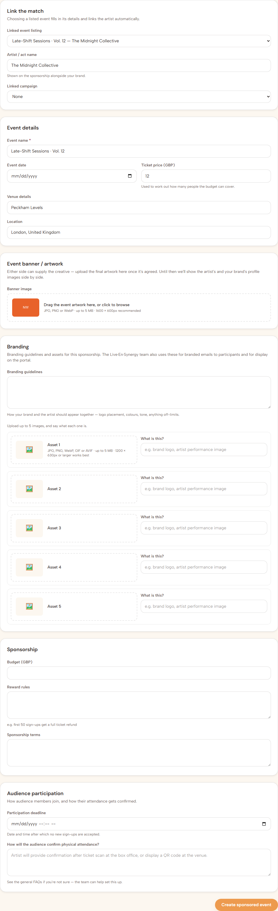

> **Fixed during this review.** The artist name was not filling in. The screen
> was reading the artist's record directly, which our access rules correctly
> restrict to the artist themselves, so a brand always received an empty result.
> It now reads the public artist profile instead. Everything else on the form
> had been filling correctly throughout.

---

#### B-SPON-02 — Event banner + branding guidelines and assets — **Done**

Either party can upload the final artwork. Below it, branding guidelines are
captured as free text alongside **up to five images, each with its own
description** — exactly as requested, and noted on-screen as material the
Live·En·Synergy team will also use for participant emails and portal display.

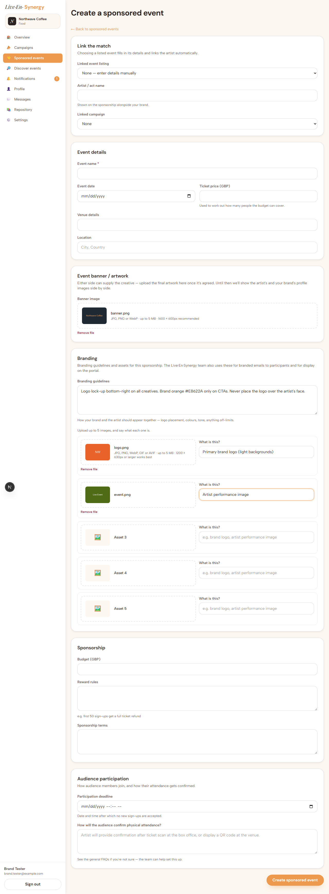

---

#### B-SPON-03 — Audience participation — **Done**

Participation deadline captures **both a date and a time**. Attendance
confirmation is a free-text field carrying your suggested placeholder about
ticket scanning at the box office or a QR code at the venue, with a pointer to
the general FAQs beneath it.

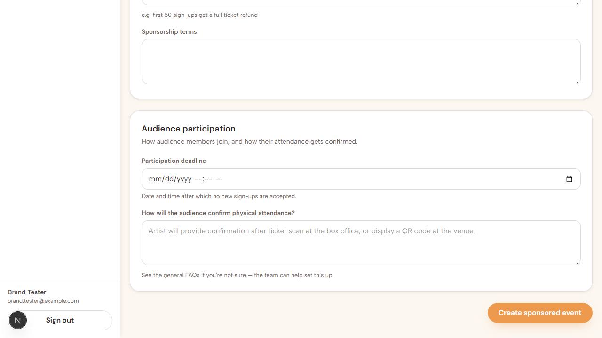

---

### 1.4 Sponsored events — after creation

#### B-SPON-04 — Sponsored events grouped by status — **Done**

The tab was previously a single undifferentiated list. It is now split into
**Confirmed sponsorships**, **Awaiting agreement** and **Completed**, confirmed
first. The confirmed section is always shown, even when empty, so its absence is
never mistaken for a missing feature.

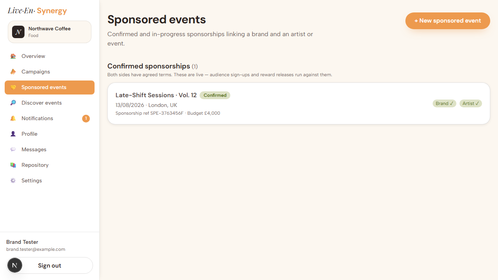

---

#### B-SPON-05 — Locked after confirmation; full event details — **Done**

Both points from the notes are in place. Terms lock as soon as the sponsorship
is confirmed, with **Contact Live·En·Synergy** as the route to any change and
**Mark completed** once the event has run. The full linked event details —
date, venue, ticket price, capacity — are shown on the sponsorship itself, along
with the budget breakdown and the participation funnel.

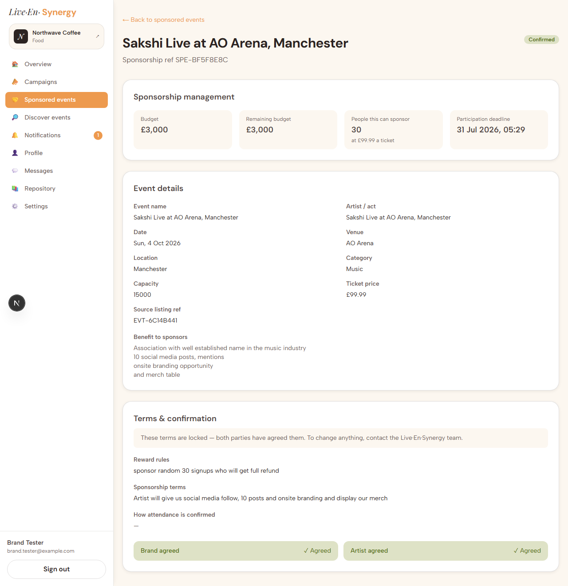

---

#### B-SPON-06 — "Can a default banner be created from the artist's profile picture × the brand's profile picture?" — **Not done**

Not yet built. Where no artwork has been uploaded, the sponsorship currently
shows no banner at all rather than a composite of the two profile images.

This one needs attention either way, because the creation form already tells the
user *"Until then we'll show the artist's and your brand's profile images side
by side"* — wording that describes behaviour which does not exist. Either the
composite gets built or that sentence should be corrected; we would suggest
building it, as it was your original request.

---

### 1.5 Discover events

#### B-DISC-01 — Filters, plus sponsorship state on each tile — **Done**

Filtering by **Name, Location, Category and Month** is in place. Filters are
applied by page address, so a filtered view can be bookmarked or shared.

Following your later note, each tile now also states its sponsorship status at a
glance:

- **Open for sponsorship** (green) — available
- **★ Sponsored by you** (orange, outlined) — your own sponsorship; the button
  becomes *Open your sponsorship*
- **Already sponsored** (lilac) — another brand got there first

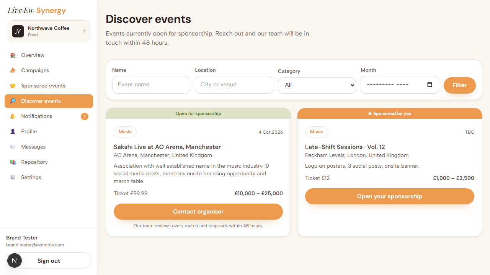

> **Found while building this.** Creating a sponsorship did not mark the
> underlying listing as taken, so events you had already sponsored continued to
> appear as though they were free. The tile state now makes this visible. Making
> the listing itself change status is a further change, noted below.

---

### 1.6 Profile

#### B-PROF-01 — Profile and banner image — **Done**

Brand logo and banner upload both work, with the recommended dimensions stated
under each picker (logo 600 × 600px square; banner 1600 × 600px; 5 MB limit).

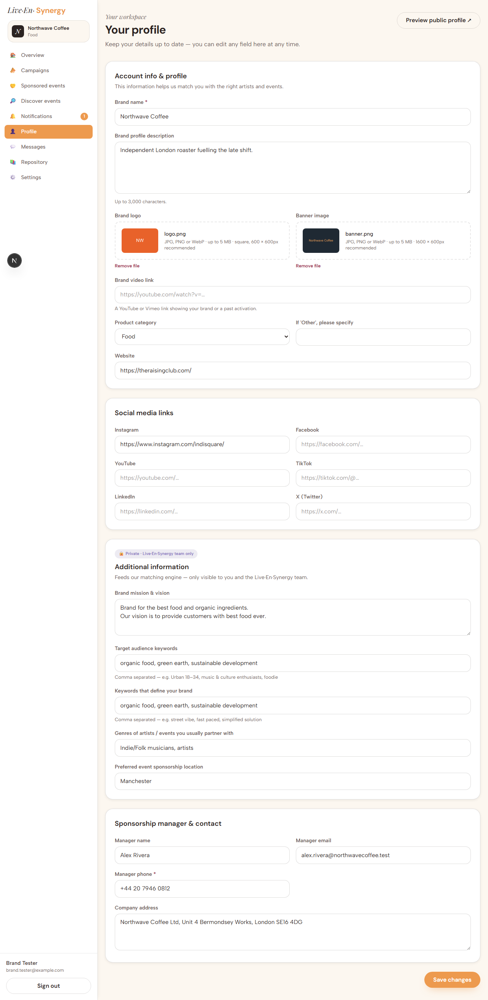

> **Fixed during this review.** Saving a logo or banner previously failed with
> *"Application error: a client-side exception has occurred"*. The cause was a
> 1 MB ceiling on form submissions that the platform applies by default, which
> any real logo exceeds — the request was rejected before it ever reached our
> code. The ceiling has been raised to 32 MB, oversized files are now refused in
> the browser with a clear message rather than a crash, and any unexpected error
> now shows a recoverable page instead of a blank one. **This was not related to
> the Supabase plan**; the 5 MB image limit is our own setting.

Confirmed working — the same upload now saves successfully:

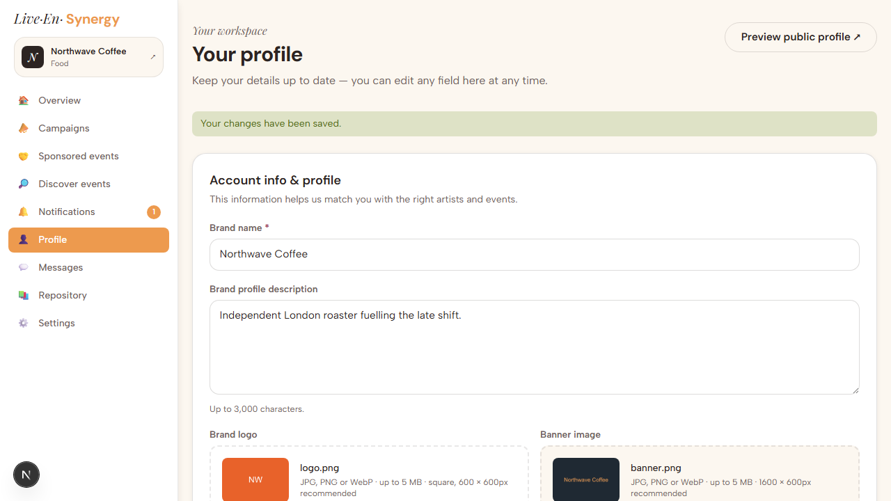

---

### 1.7 Messages

#### B-MSG-01 — Chat split into two categories — **Done**

Conversations are separated into **With artists & sponsors** and **With
Live·En·Synergy team**, each with its own count.

---

#### B-MSG-02 — Attachments; details open in a new tab — **Done**

Attachments support images, PDFs, Office documents and video clips at up to
**25 MB per file**. Where a conversation is tied to an event or a campaign, an
**Event details ↗ / Campaign details ↗** link opens it in a new tab so the
thread is not lost.

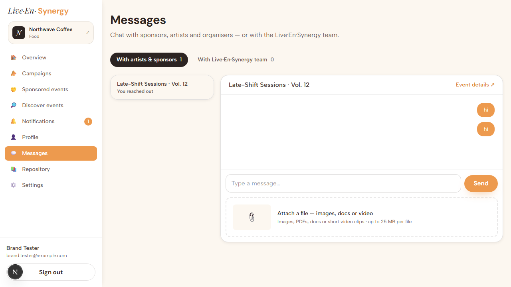

---

#### B-MSG-03 — "A chatbox for each campaign submitted" — **Not done**

The groundwork is in place — a conversation can already be attached to a
campaign, and the thread header is built to display *Campaign details ↗* when it
is — but nothing yet creates that thread at the moment a campaign is submitted.
This is a small piece of work rather than a new capability.

---

### 1.8 Repository

#### B-REPO-01 — Repository section — **Partial**

The section is built and reachable from the sidebar beside Settings. The
**pricing structure** is live and generated from the actual fee model, and
**FAQs, Terms & Conditions, Privacy Policy** and **Contact** are all linked.

**Limitation:** four entries — *How it works* videos, *Sponsor guidelines*,
*Artist & organiser guidelines* and the *Blog* — are present as placeholders
awaiting content from your side. The structure is finished; the material is not
yet written.

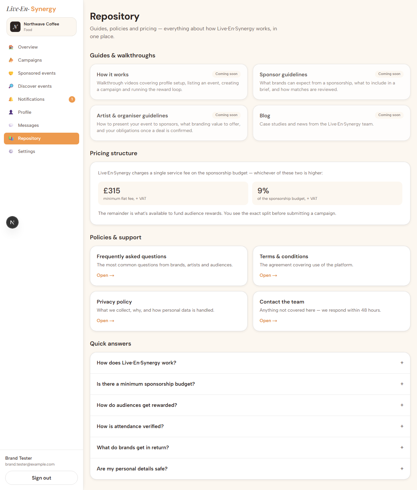

---

## 2. Artist Portal

### A-OV-01 — "What triggers the Sponsor offers pending status/number?" — **Answered**

It counts sponsorship proposals sent to this artist that they have **not yet
agreed to**. It decreases by one each time the artist accepts a proposal, and
reaches zero when nothing is awaiting their response.

---

### A-EV-01 — "Can My events be split into Published and Sponsored?" — **Done**

Two tabs, each with its own count.

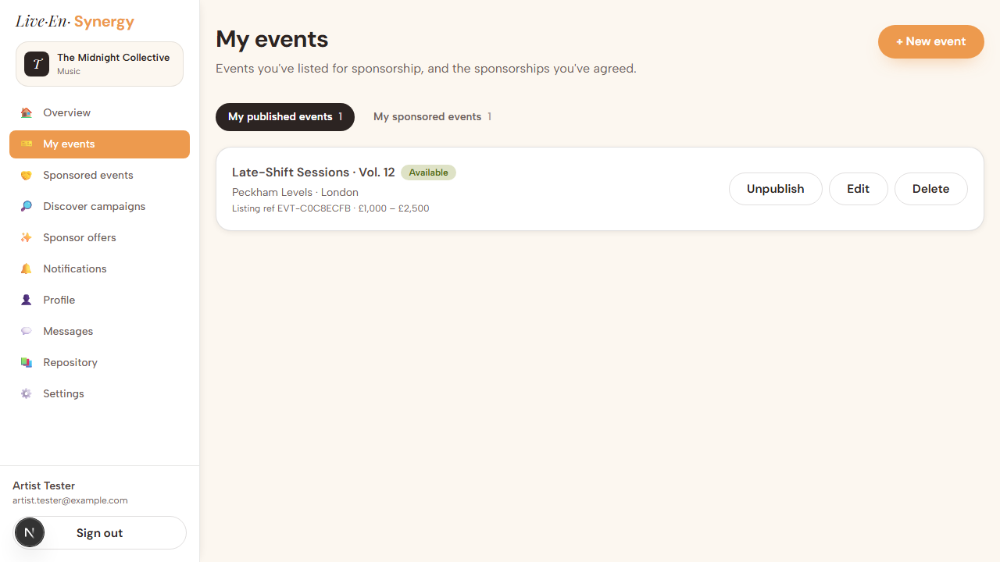

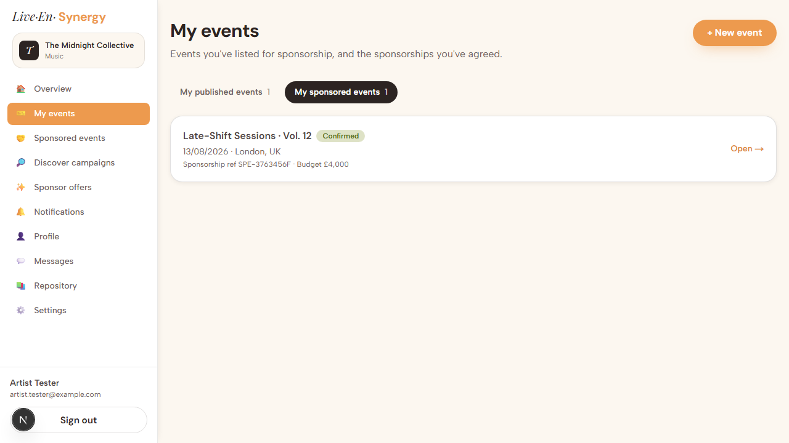

---

### A-EV-02 — Event image upload — **Done**

Artwork upload is on the event form, with the recommended size stated
(1200 × 630px or larger, 5 MB limit).

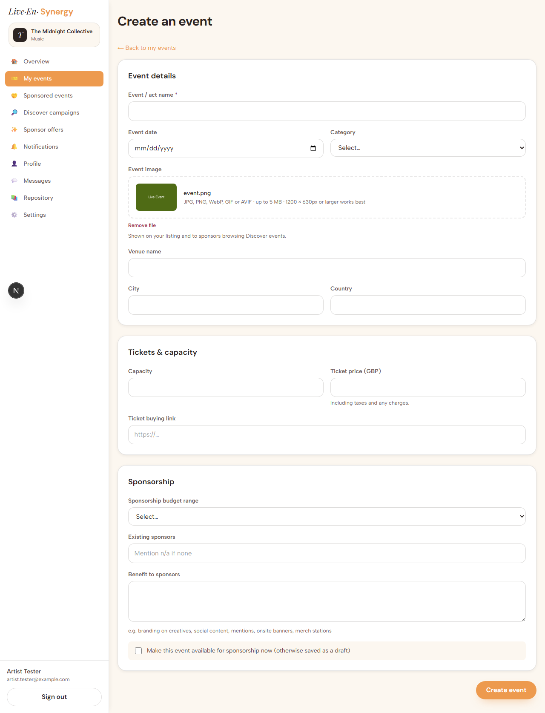

---

### A-SPON-01 — "Option to create Sponsor event and link brand's profile and campaign" — **Not done**

Creating a sponsored event is currently **restricted to brands**. An artist
navigating to that screen is returned to their dashboard, as the screenshot
shows.

The nearest equivalent available to an artist today is **Discover campaigns →
Register interest**, which notifies the Live·En·Synergy team to broker the match
rather than creating the sponsorship directly. Opening this up to artists is a
design decision as much as a build one — it would let an artist propose terms
against a brand's budget — so we would like your direction before building it.

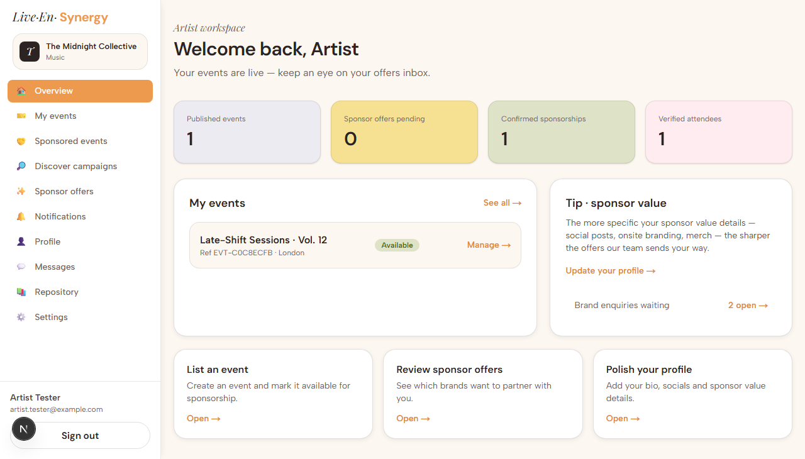

---

### A-DC-01 — "Can Discover Campaigns be created like Discover Events, with filters?" — **Done**

Artists and organisers can browse open campaign briefs, filtered by **brand or
keyword, location, category and minimum budget**. Sponsor contact details are
deliberately withheld from this view — the team brokers the introduction.

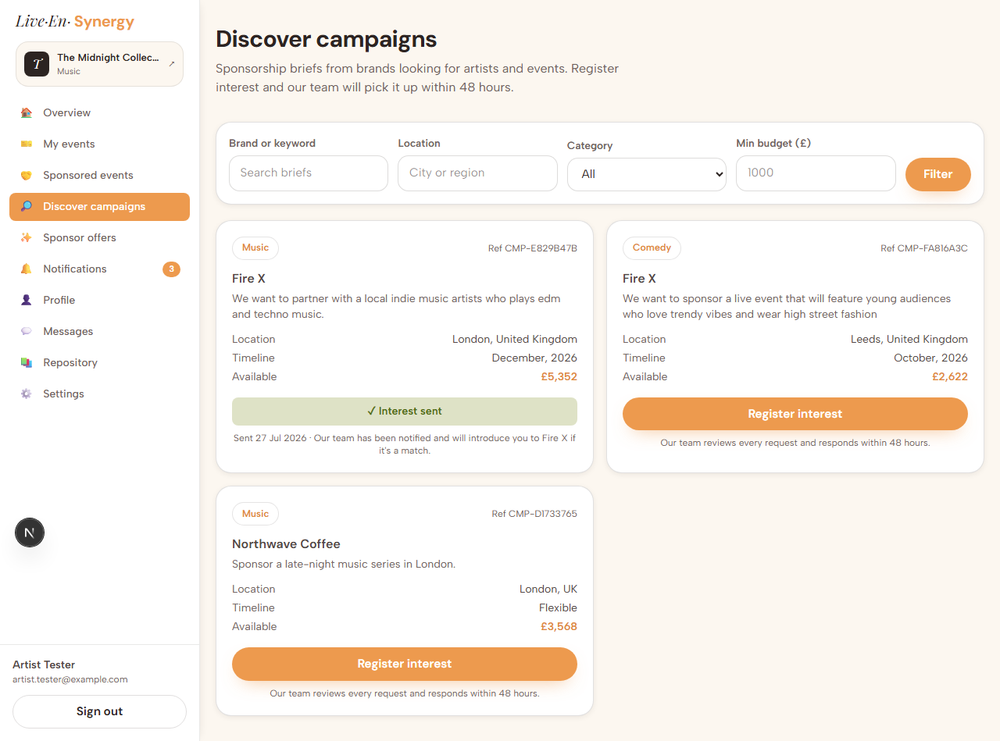

---

### A-MSG-01 — Split threads, attachments, details in a new tab — **Done**

Identical to the Brand Portal: conversations separated into *With artists &
sponsors* and *With Live·En·Synergy team*, attachments up to 25 MB, and event or
campaign details opening in a new tab.

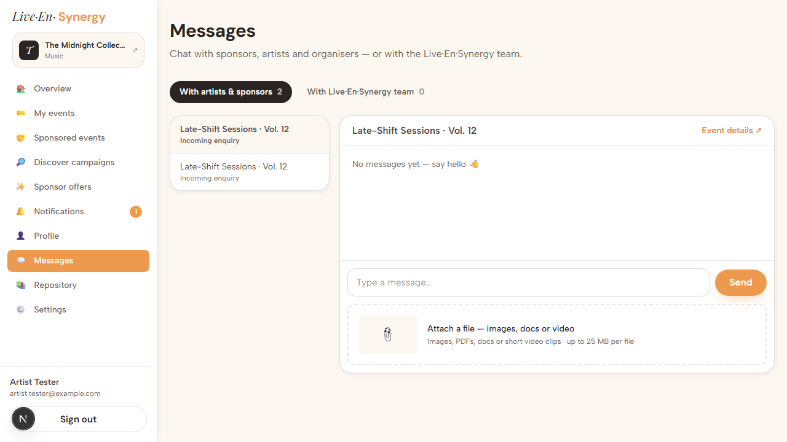

---

### A-MSG-02 — "A chatbox for each campaign submitted" — **Not done**

Same as [B-MSG-03](#b-msg-03--a-chatbox-for-each-campaign-submitted--not-done);
outstanding for both portals.

---

### A-REPO-01 — Repository — **Partial**

Same section and same content gap as the Brand Portal.

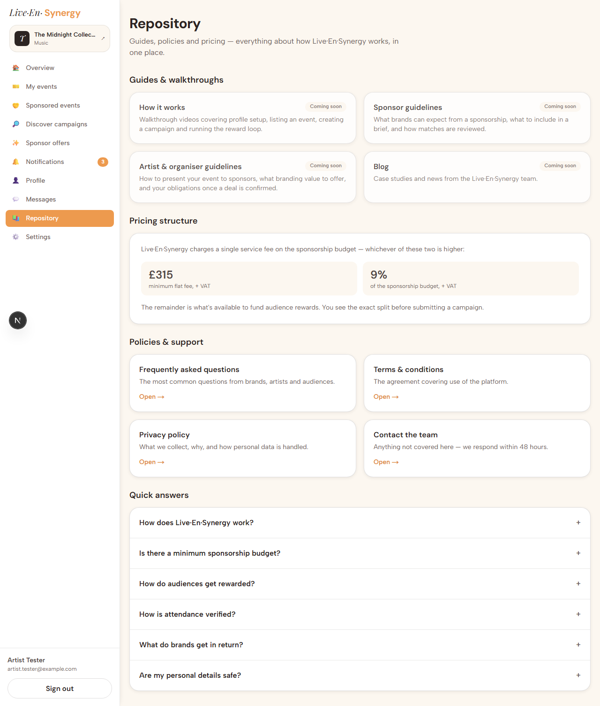

---

### A-PROF-01 — Profile and banner image on the Artist side — *verification*

Not a point from the Artist notes, included for completeness: the image upload
fix described in [B-PROF-01](#b-prof-01--profile-and-banner-image--done) was
confirmed on the artist profile as well, so the fault is resolved for every
role rather than for brands alone.

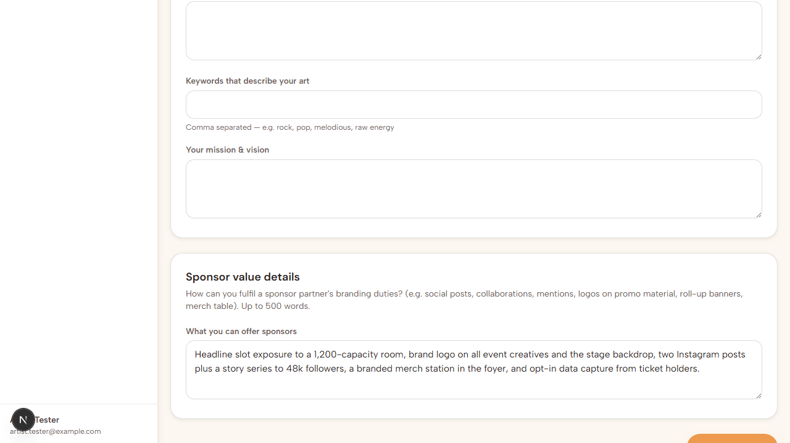

---

## Questions answered

| Question from the notes | Answer |
| --- | --- |
| What triggers the *Sponsor offers pending* number? | Sponsorship proposals sent to the artist that they have not yet agreed to. |
| Can event details autofill when a listing is selected? | Yes — name, date, ticket price, venue, location and artist name. Fixed during this review. |
| Can a default banner be built from the artist's and brand's profile pictures? | Not yet built — see outstanding items. |
| What image size should be used? | Logo **600 × 600px** square · Banner **1600 × 600px** · Event & campaign artwork **1200 × 630px** or larger. All up to **5 MB**, in JPG, PNG, WebP, GIF or AVIF. |
| What video size is permitted in chat? | **25 MB per file**, covering images, PDFs, Office documents and short clips. For longer showreels we recommend the YouTube/Vimeo link field already on artist and brand profiles. |
| Can full event details be displayed on a sponsored event? | Yes — implemented. |
| Can neither party edit details after confirmed status? | Correct — terms lock on confirmation. *Contact Live·En·Synergy* and *Mark complete* remain available. |

---

## Outstanding items

Four items remain. Three are build work; the fourth needs material from you.

| # | Item | What it needs |
| --- | --- | --- |
| 1 | Campaign artwork is stored but never displayed, and the "brand profile image used by default" fallback does not exist | Build — no decisions required |
| 2 | Default sponsorship banner combining the artist's and the brand's profile images | Build. The form currently promises this in its wording, so either the feature or the wording should change |
| 3 | A chatbox created automatically for each campaign submitted | Build — the underlying groundwork is already in place |
| 4 | Repository content: *How it works* videos, Sponsor guidelines, Artist & organiser guidelines, Blog | **Content from your side** — the structure is finished |

One further item surfaced during testing, not raised in the notes: creating a
sponsorship does not mark the underlying event listing as taken, so it continues
to be advertised as available. The Discover tiles now make the true state
visible, but changing the listing's own status would be the more complete fix.
We would recommend it.

---

## Notes on this test run

- **Environment:** local development build against the development database,
  using the seeded Brand (*Northwave Coffee*) and Artist (*The Midnight
  Collective*) test accounts. No live customer data was involved.
- **Deployment status:** the profile image upload fix is already live. The
  status-grouped Sponsored events tab, the Discover tile indicators, the budget
  guard and the artist-name autofill fix are verified and awaiting deployment.
- **Reproducing:** `npx playwright test` with the development server running
  regenerates every screenshot in this document.
