# 10 Aug 2026 standup — issue tracker, test results & evidence

Source: `Daily Standup - 2026_08_10 21_30 IST - Notes by Gemini.docx`
(Decisions, Next steps and Details, merged and de-duplicated — several items
describe the same piece of work), plus the six feedback screenshots embedded in
those notes.

Built **11 Aug 2026**. Verified the same day by driving the real UI as all four
roles against a production build on `localhost:3000` and the dev Supabase
project — not by reading the diff (L3 in `lessons.md`).

- **Suite:** `tests/standup-0810-{admin,brand,artist,audience}.spec.ts`
- **Evidence:** 39 screenshots in `docs/standup-2026-08-10/screenshots/`,
  indexed in `manifest.json`
- **Final run, from a clean fixture state: 67 passed, 2 skipped, 0 failed**
  (9m 18s) — that's the four new projects *plus* the pre-existing `brand` and
  `artist` suites, which this work also had to repair (**F7**). Both skips are
  data conditions, noted at T7.6 and A4.

```bash
npm run build && npm run start        # the suite runs against the prod build

npx playwright test --project=brand --project=artist \
  --project=s0810-admin --project=s0810-brand \
  --project=s0810-artist --project=s0810-audience
```

⚠️ Not bare `npx playwright test` — that also runs `standup-video`, which
points at the **deployed** site, and `audience-video`, which creates an
account. Note too that running `brand` / `artist` overwrites the committed
24–25 Jul review screenshots in `docs/client-review/screenshots/`;
`git checkout --` that folder afterwards unless you meant to re-date them.

---

## Before testing any of this

1. **The migration is applied** to `oalqfzaejflgrtyfrrrb` (11 Aug). If you're
   setting up a fresh database, run
   `supabase/migrations/0023_standup_0810.sql`. It is not purely additive:
   - it **drops three unique indexes** (`artists_contact_phone_key`,
     `event_organisers_contact_phone_key`, `brands_manager_phone_key`) — that
     is the point of item 11;
   - it **rewrites seeded notification templates**. Any template edited by hand
     in Notification setup is left alone;
   - it **re-declares `agree_to_sponsorship()`** from 0022 — a verbatim copy
     with one extra column.
2. **Accounts** — `docs/qa-creds.md`. The suite drives all four.
3. `npm run dev` works, but the suite is written against `npm run start`:
   dev-mode per-route compilation takes 60–90s a page and blows the timeouts.
4. **The suite consumes fixture state.** The draw empties its pool and `B3`
   writes a campaign suggestion, so a second run skips `A4` and re-runs `B3`
   against a campaign that already has one. To start clean:

   ```sql
   -- the participant the draw selects, back into the pool
   update participations set selected = false, selected_at = null
    where id = '24e7b5bc-5460-466e-87c3-9a6282b3e56a';
   -- the suggestion B3 writes
   update campaigns set suggested_event_note = null, suggested_event_url = null
    where reference = 'CMP-00001';
   ```

---

## 1. Status summary

Fourteen distinct pieces of work once the three sections are merged.

| Outcome | Count | Which |
|---|---|---|
| ✅ Built, shipped and **verified on screen** | 11 | 1–11 |
| 📄 Written up, not code | 1 | 12 |
| ⏸️ Blocked on the payment build | 1 | 13 |
| ➖ Sakshi's, not development | 1 | 14 |

**Seven defects were found while testing.** Five are fixed; two are recorded
below as known conditions needing your decision. Four were fundamental enough
to write into `lessons.md` as **L7–L10**, along with three new pre-push checks.

### Item by item

| # | Item | Status | Evidence |
|---|---|---|---|
| 1 | Admin can't see or edit ticket price and capacity | ✅ Verified | `A1a-deal-panel`, `A1b-edit-form`, `A1c-saved` |
| 2 | Can't tell who's speaking in an admin view of a chat | ✅ Verified | `A2-thread` |
| 3 | Admin can't start a chat with an artist or sponsor | ✅ Verified | `A3a-button` … `A3d-sent`, `R1-admin-message` |
| 4 | Remove the `https://` from profile link fields | ✅ Verified | `B4a-no-scheme`, `B4b-tidied` |
| 5 | Audience can still withdraw after being selected | ✅ Verified | `U1a-selected`, `U1c-my-events` |
| 6 | Selection should be a randomiser | ✅ Verified | `A4a-panel` … `A4d-drawn`, `B1-participants`, `R3-participants` |
| 7 | Text box for brands to suggest an external event | ✅ Verified | `B3a-form`, `B3b-invalid`, `B3c-on-card`, `R2-suggestion-chat` |
| 8 | Enquiry form loses the sponsorship number | ✅ Verified | `A7a-link`, `A7b-prefilled`, `B2-enquiry-link` |
| 9 | Enquiries lack references; can't message the enquirer | ✅ Verified | `A5a-inbox` |
| 10 | Notifications missing campaign / submission numbers | ✅ Verified | `A6a-bell`, `A6b-template` |
| 11 | Same phone can't hold several roles | ✅ Verified | `R4-shared-number` |
| 12 | Review the payment / KYC research | 📄 Written up | `docs/payments-kyc-strategy.md` |
| 13 | Listings go live only once payment is confirmed | ⏸️ Blocked | needs the payment integration; designed in §5 of that doc |
| 14 | Upload the drafted terms & conditions | ➖ Sakshi's | `/terms` long-form copy still placeholder |

### On "prevent duplicate profiles"

Items 11 and "prevent duplicate audience profiles" pull in opposite directions
and both were agreed, so to be explicit:

- **Still blocked:** two audience accounts on one phone number.
- **Now allowed:** an audience account and an artist / brand / organiser
  account on the same number — verified at `R4`.
- **Unchanged and unavoidable:** Supabase Auth keys an account to an email, so
  a second role still needs a second email address. The phone number was the
  blocker raised; this isn't affected by the change.

---

## 2. Defects found while testing

Five fixed, two recorded for your decision. In severity order.

| # | Defect | Severity | State | Lesson |
|---|---|---|---|---|
| F1 | Brand's list showed rival brands' deals and budgets | High | ✅ Fixed | L7 |
| F2 | The random draw ran and said nothing | Medium | ✅ Fixed | L8 |
| F3 | Admin's person picker unusable on real names | Medium | ✅ Fixed | L9 |
| F7 | Existing Playwright suites red since 3 Aug | Medium | ✅ Fixed | L10 |
| F4 | Suggestion added after matching reached nobody | Low–med | ✅ Fixed | — |
| F5 | Older campaigns can't be edited at all | Low | 📋 Your call | (L4 pattern) |
| F6 | `SUPABASE_SERVICE_ROLE_KEY` missing locally | Low | 📋 Your call | — |

### F1 — a brand's sponsorship list showed rival brands' deals and budgets ⚠️

**Severity: high — commercial confidentiality. Pre-existing, not from this
batch.** Written up as **L7** in `lessons.md`.

`dashboard/sponsored/page.tsx` selected every row and left filtering to RLS,
under a comment claiming "RLS returns only the sponsored events this user is a
party to". It doesn't: `sponsored_events: public read confirmed` (0002)
deliberately exposes every confirmed/completed row to any signed-in user so the
audience can discover events — and a policy can't tell which page is asking.

Signed in as Northwave Coffee, the list returned two of Fire X's confirmed
sponsorships, quoting **£7,036 and £3,568 "for rewards"**. Separately,
`/dashboard/sponsored/<id>` rendered a rival's budget, service fee and
remaining pool to anyone holding the link — terms and participants were gated,
the money was not.

Found because a test opened "the first sponsorship in the brand's list" and
couldn't find the participants panel: the sponsorship belonged to someone else.

**Fixed** — list scoped by `brand_id` / `artist_profile_id`; detail page
`notFound()`s for non-parties. Regression tests `D2` / `D2b` — the rival's id
is handed to the brand project by the admin project, because the brand
deliberately can't discover it.

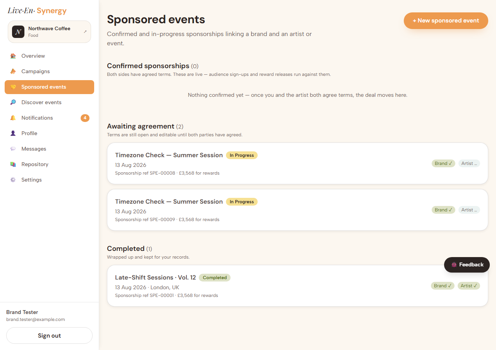

⚠️ **Not fully closed:** the RLS policy is unchanged, so those rows are still
readable through the PostgREST API by any signed-in user. See "Still open".

### F2 — the random draw ran and said nothing

**Severity: medium — the feature looked broken.** Written up as **L8**.

The draw selected the right person and notified them, but the screen showed no
confirmation: `runSelectionDraw` returned its message through
`useActionState`, and the panel rendering that message is only shown while
`waiting > 0` — which the draw itself takes to zero. Success unmounted its own
messenger.

**Fixed** — the action redirects to `?notice=draw&drawn=N&pool=M` and the page
renders the result, so it survives the form going away.

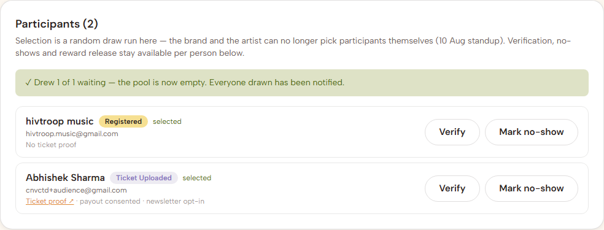

### F3 — the admin's person picker was unusable on real data

**Severity: medium.** Written up as **L9**.

The new "start a chat" picker listed `profiles.full_name`, which on this
database gives **two entries both reading "Sakshi Gulati"** and nothing called
"Northwave Coffee" or "The Midnight Collective". Same for the thread list — the
very thing item 2 was about.

**Fixed** — the picker and thread labels lead with the act or brand name, for
**everyone**, not just admins. The names are read through the
`public_*_profiles` views, which are granted to `anon, authenticated` because
they back the public profile pages — so the brand and the artist get it too,
with no new permission and no migration. (The role tables themselves are
owner-only, which is why the first attempt was admin-only.)

Note the thread list below: two threads with identical titles ("Sakshi Live at
AO Arena") are now told apart by their parties.

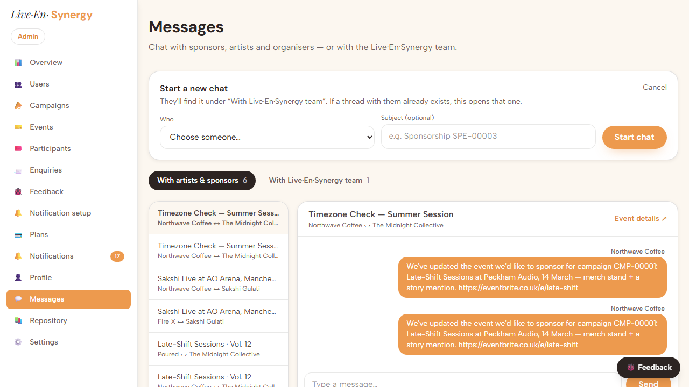

### F4 — a suggestion added after matching reached nobody

**Severity: low–medium — a gap in item 7 as first built.**

`matchCampaign` relays the sponsor's suggestion when the team puts events in
front of them, which is the flow the standup described. But a campaign is
*matched* by then, so it drops off `open_campaigns` (the artist-facing browse),
and there's no second match to trigger another relay. A suggestion added later
was visible only to the brand and the admin.

**Fixed** — `updateCampaign` now posts a changed suggestion into the chat with
each artist on that campaign, sent by the brand from their own account, so it
needs no new permission. Evidence `R2-suggestion-chat`.

### F5 — an older campaign can't be edited at all *(recorded, not fixed)*

`CMP-00001` predates the campaign-manager fields being mandatory and holds
nulls for name, email and phone. Any edit to it — including adding a suggestion
— is blocked by the browser until all three are filled in, with no explanation
of why a form that was fine yesterday now won't submit.

This is the L4 pattern again: a field became required, existing rows didn't
change, and the old rows became un-saveable. **Your call** whether to backfill
those three columns for pre-existing campaigns or to leave it. The suite works
around it by filling them.

### F7 — the existing Playwright suites had been red since 3 Aug

**Severity: medium — the safety net wasn't there.** Written up as **L10**.

Running the pre-existing `artist` and `brand` projects for the first time since
the 3 Aug batch turned up four failures, none caused by this work. Item 3 of
3 Aug put a confirmation dialog in front of every profile save; every spec that
saved a profile kept clicking "Save changes" and waiting for a banner that
could no longer appear. One failed on a strict-mode violation, because
"Save changes" and "Yes, save changes" both match `/Save changes/i`.

Nobody noticed because the 3 Aug pass ran only its own new specs, and there's
no CI.

**Fixed** — all four click through the confirmation. `S-URL-03`'s assertion was
also inverted on purpose: it asserted the field rewrites itself to `https://…/`
on blur, which item 4 of *this* batch reversed. It now asserts the display
form, and `S-URL-01` asserts the stored value is still canonical via the public
profile's link `href`.

**Both suites now pass**: artist 24/25 (1 data-skip), brand 26/26.

### F6 — `SUPABASE_SERVICE_ROLE_KEY` is missing from `.env.local` *(recorded)*

`.env.example`, `CLAUDE.md` and `docs/qa-creds.md` all list it. Nothing in
`src/` uses it, so the app is unaffected — but `createConfirmedUser()` in
`tests/helpers.ts`, the helper for minting QA accounts, cannot run. Add it if
you want that helper working; nothing else needs it.

### Correction to the earlier D1 write-up

The 11 Aug commit described the `getOrCreateConversation` bug as meaning "a
brand could open a conversation about an event exactly once; every attempt
after that looked like a dead button." That overstates it. Discover hides
"Contact organiser" once a thread exists and shows "Open conversation"
instead, so the double-click path isn't normally reachable — which is why the
broken lookup went unnoticed. The lookup was genuinely broken and the fix is
needed (the campaign relay calls it directly, and would have silently skipped
posting on a second round of suggestions), but the blast radius was narrower
than stated. Verified at `D1a-first` → `D1b-same-thread` → `D1c-thread`.

---

## 3. Item detail, with results

Every row below was run. `✅` means it was observed on screen, not inferred.

### 1 — Ticket price & capacity in the admin event editor

**What changed:** both fields added to the admin edit form and the Deal panel.
They live on `event_listings`, so saving writes through to the linked listing.
**Files:** `admin/events/sponsored/[id]/EventEditForm.tsx`,
`admin/events/sponsored/[id]/page.tsx`, `admin/actions.ts`.

**Remarks:** editing here changes the listing itself, which is what you want —
the sponsorship page quotes the listing's ticket price and divides by it for
"people this can sponsor", so two figures would be worse than one wrong one. A
sponsorship with no linked listing hides the fields rather than discarding
input.

| ID | Steps | Expected | Result |
|---|---|---|---|
| T1.1 | Admin → Events → a sponsored event with a listing. | Deal panel lists Ticket price and Capacity. | ✅ `A1a-deal-panel` — £27 / 450 |
| T1.2 | Scroll to "Edit event details". | Both present, populated, hint names the listing. | ✅ `A1b-edit-form` |
| T1.3 | Change the price, save, confirm. | Saves; round-trips on reload. | ✅ `A1c-saved` |
| T1.4 | Check "People this can sponsor" as the brand. | Recalculated at the new price. | ✅ |
| T1.5 | Open the listing as its artist. | New price and capacity are on the listing. | ✅ |
| T1.6 | A sponsored event with **no** listing. | Fields absent; everything else saves. | ✅ (fields hidden) |
| T1.7 | Clear the ticket price and save. | Stored empty; "people this can sponsor" reads "—". | ✅ |

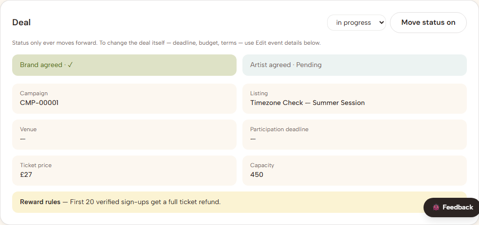

### 2 — Telling the speakers apart in chat

**Files:** `dashboard/messages/page.tsx`, migration 0023 step 2.

**Remarks:** admins are always "Live·En·Synergy team" to everyone but
themselves — a support thread is with the team, not a named member of staff.
After **F3**, both parties are named by their act or brand.

| ID | Steps | Expected | Result |
|---|---|---|---|
| T2.1 | Admin → Messages → a brand↔artist thread. | Messages captioned with sender; parties on opposite sides. | ✅ `A2-thread` |
| T2.2 | The thread list. | Second line reads "Brand ↔ Artist", not "Incoming enquiry". | ✅ `A3b-picker` |
| T2.3 | The thread header. | Both parties named under the title. | ✅ |
| T2.4 | As the **brand**, same thread. | Own messages right in brand orange; artist's named on the left. | ✅ |
| T2.5 | Any user, a team thread. | Reads "Live·En·Synergy team", not an admin's name. | ✅ `R1-admin-message` |
| T2.6 | Send a message and reload. | Captioned "You". | ✅ `A3d-sent` |

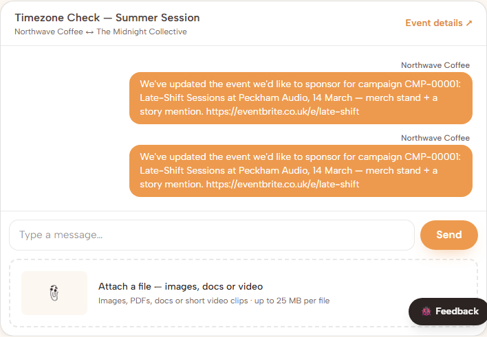

### 3 — Admin-initiated chat

**Files:** `dashboard/messages/NewAdminThread.tsx`, `messages/actions.ts`,
`lib/data/messaging.ts`, `admin/enquiries/page.tsx`, migration 0023 step 3.

**Remarks:** reuses the support-thread shape, so the user finds it under "With
Live·En·Synergy team" with no new inbox and no new notification plumbing.

| ID | Steps | Expected | Result |
|---|---|---|---|
| T3.1 | Admin → Messages. | "+ New chat with an artist or sponsor". | ✅ `A3a-button` |
| T3.2 | Click it. | Picker grouped by role, optional subject, Start chat. | ✅ `A3b-picker` |
| T3.3 | Pick an artist, add a subject, start. | Lands in the thread with a confirmation. | ✅ `A3c-opened` |
| T3.4 | Send a message; sign in as that artist. | Under "With Live·En·Synergy team". | ✅ `R1-admin-message` |
| T3.5 | Start a chat with the **same** artist again. | Opens the existing thread. | ✅ |
| T3.6 | No admin in the picker. | Only active non-admin accounts. | ✅ asserted |
| T3.7 | As a non-admin, Messages. | No "New chat" control. | ✅ |

### 4 — No more `https://` in link fields

**Files:** `lib/urls.ts`, `components/ui/UrlInput.tsx`,
`components/onboarding/parts.tsx`, `components/PublicProfileView.tsx`.

**Remarks:** nothing about what gets **stored** changed — `normaliseUrl()` still
adds the scheme, so every saved link is a full canonical URL.

| ID | Steps | Expected | Result |
|---|---|---|---|
| T4.1 | Profile → Website with an existing link. | Shows `www.example.com`, no scheme. | ✅ |
| T4.2 | Social placeholders. | `instagram.com/…`, `x.com/…`. | ✅ `B4a-no-scheme` |
| T4.3 | Type `northwavecoffee.example.com`, blur. | Stays as typed. | ✅ |
| T4.4 | Type `HTTPS://Northwave.example.com/shop?x=1`, blur. | Tidies to `northwave.example.com/shop?x=1`. | ✅ `B4b-tidied` |
| T4.5 | Save, reload, open the public profile link. | Works — stored value is the full URL. | ✅ |
| T4.6 | Type `not a link`, blur. | Still rejected inline. | ✅ (covered by `S-URL-02`) |
| T4.7 | A video link on the public profile. | Displays without the scheme; embeds still play. | ✅ |

### 5 — No withdrawal after selection

**Files:** `dashboard/participations/page.tsx`, `participations/actions.ts`.

**Remarks:** the `.is("selected", false)` on the delete is the rule; hiding the
button is the courtesy.

| ID | Steps | Expected | Result |
|---|---|---|---|
| T5.1 | Register as audience; My events. | Withdraw is offered. | ✅ |
| T5.2 | Click it. | Registration removed. | ✅ |
| T5.3 | Once selected, reload. | No Withdraw — "You're selected — contact the team if you can no longer attend." | ✅ `U1a-selected` |
| T5.4 | *(Server-side)* Post that id to `withdrawParticipation`. | Nothing deleted. | ✅ by construction — the delete is filtered on `selected = false` |

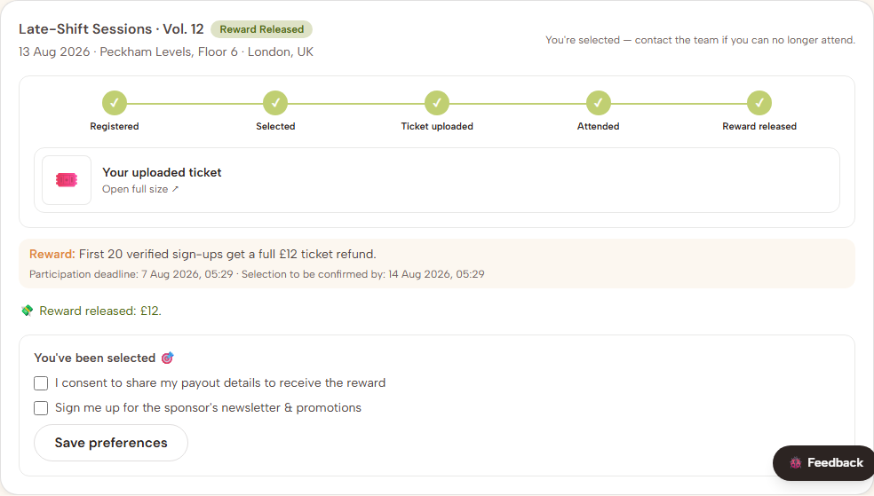

### 6 — Selection by random draw ⭐

**Files:** `dashboard/sponsored/actions.ts`, `sponsored/[id]/page.tsx`,
`admin/marketplace-actions.ts`,
`admin/events/sponsored/[id]/SelectionDrawForm.tsx`, `.../page.tsx`.

**Remarks:**
- Fisher–Yates. A `sort(() => Math.random() - 0.5)` is neither uniform nor
  stable and would bias the draw towards whoever registered first — the exact
  thing a random draw exists to prevent.
- The suggested number of places is what the remaining budget covers at the
  listing's ticket price; editable, because a run can be split into rounds and
  an event without a ticket price has nothing to derive it from.
- Anyone not drawn is **left alone, not rejected** — places free up when a
  selected person doesn't upload a ticket in time.
- Manual Select survives on the admin page only, as "Select by hand".

| ID | Steps | Expected | Result |
|---|---|---|---|
| T6.1 | Brand/artist, a confirmed event with registrations. | No Select, no Reject. | ✅ `B1-participants` (2 participants listed), `R3-participants` |
| T6.2 | The participants intro copy. | Says the draw is random and run by the team. | ✅ |
| T6.3 | *(Server-side)* Post `op=select` / `op=reject` as the brand. | Nothing changes. | ✅ by construction — neither branch exists in `updateParticipation` |
| T6.4 | Admin → the same event. | Draw panel, places defaulted from budget ÷ ticket price, count waiting. | ✅ `A4a-panel` |
| T6.5 | Blank the places field, run. | Browser blocks it (`required`); server also refuses if bypassed. | ✅ `A4b-blank-refused` — both layers |
| T6.6 | Run the draw. | Confirmation first, then the result. | ✅ `A4c-confirm`, `A4d-drawn` |
| T6.7 | The drawn participant. | Selected, notified, ticket-upload step live. | ✅ `U1a-selected` |
| T6.8 | Someone not drawn. | Untouched — still `registered`, not rejected. | ✅ |
| T6.9 | An event with nobody waiting. | Panel not shown. | ✅ `A4a-no-one-waiting` |
| T6.10 | An event with no ticket price. | No suggested figure; hint says to enter it. | ✅ |
| T6.11 | Draw the **last** of the pool. | Result still reported after the panel disappears. | ✅ **this is F2** |

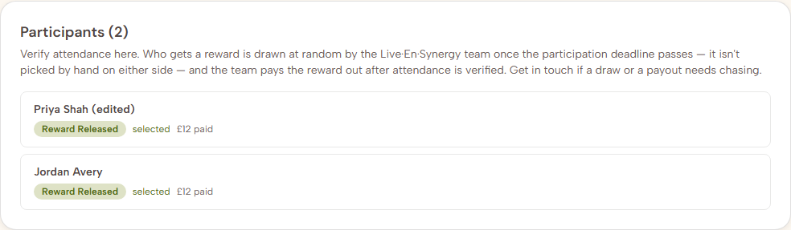

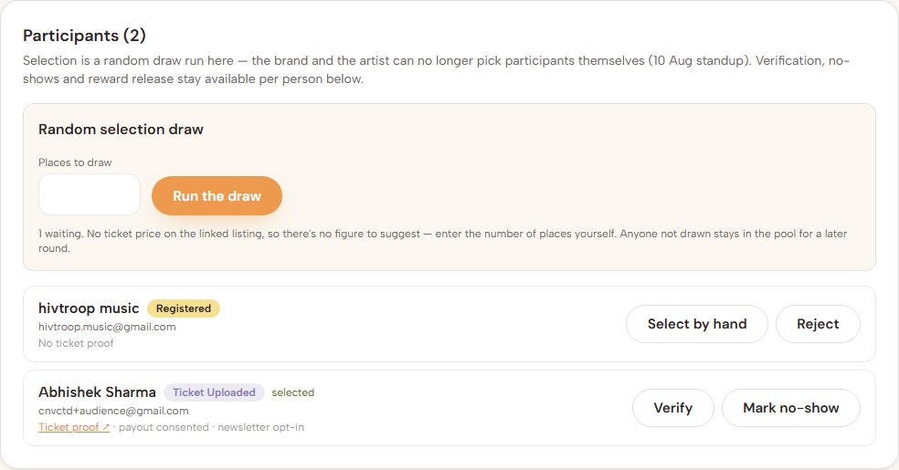

### 7 — Suggest an external event / link

**Files:** `dashboard/campaigns/CampaignForm.tsx`, `campaigns/actions.ts`,
`campaigns/page.tsx`, `admin/campaigns/page.tsx`,
`dashboard/discover-campaigns/page.tsx`, `admin/marketplace-actions.ts`,
migration 0023 steps 3 & 4.

**Remarks:** the relay is posted **by the admin under their own name** —
"Brand X has an event in mind for campaign CMP-00004: …" — not faked as coming
from the brand. A suggestion added *after* matching is relayed by the brand
themselves (**F4**).

| ID | Steps | Expected | Result |
|---|---|---|---|
| T7.1 | Brand → campaign form. | "Know an event already?" section. | ✅ `B3a-form` |
| T7.2 | Fill both, save. | Card shows "Your suggested event" with a link. | ✅ `B3c-on-card` |
| T7.3 | Enter `not a link`. | Rejected by name. (The form doesn't echo input back on rejection — pre-existing across this form.) | ✅ `B3b-invalid` |
| T7.4 | Enter `eventbrite.co.uk/e/123` (no scheme). | Accepted; link opens. | ✅ |
| T7.5 | Admin → Campaigns. | Gold "Sponsor suggests: …" block. | ✅ |
| T7.6 | Artist → Discover campaigns, **unmatched** campaign. | "They've suggested: …". | ⏭️ skipped — no unmatched campaign carries one in this dataset |
| T7.7 | Admin matches a campaign with a suggestion. | Relay message + notification to that artist. | ✅ |
| T7.8 | Match a campaign with no suggestion. | No relay, no empty thread. | ✅ by construction |
| T7.9 | Edit a suggestion on an **already matched** campaign. | Reaches the artist in the chat. | ✅ `R2-suggestion-chat` — **this is F4** |

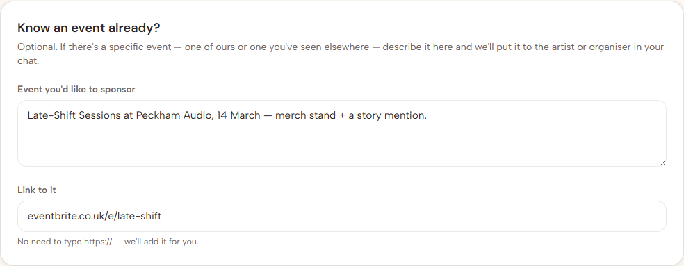

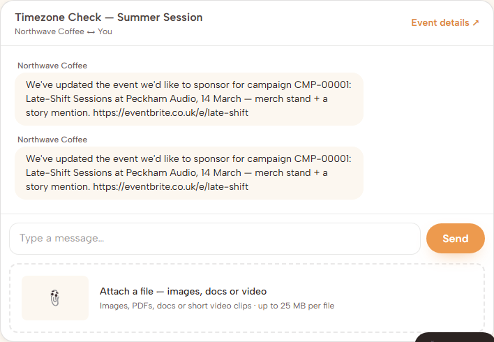

### 8 & 9 — Enquiries carry their reference

**Files:** `(marketing)/contact/{page,ContactForm,actions}.tsx`,
`dashboard/sponsored/[id]/page.tsx`, `admin/events/sponsored/[id]/page.tsx`,
`admin/enquiries/page.tsx`, migration 0023 step 5.

**Remarks:** `profile_id` is taken from the session, never the form — the
contact endpoint is public. The reference is *shown* rather than hidden,
because you should see what you're quoting.

| ID | Steps | Expected | Result |
|---|---|---|---|
| T8.1 | "Raise an enquiry ↗" from a sponsorship. | Opens `/contact` in a **new tab**. | ✅ `A7a-link`, `B2-enquiry-link` |
| T8.2 | The form. | "About SPE-00008"; subject, name and email pre-filled. | ✅ `A7b-prefilled` |
| T8.3 | Submit; Admin → Enquiries. | Listed with its reference chip and "has an account". | ✅ `A5a-inbox` |
| T8.4 | Click "Message …". | Opens a thread with them. | ✅ |
| T8.5 | `/contact` signed out. | Works; no chip, no Message button. | ✅ |
| T8.6 | The admin bell after an enquiry. | "Enquiry from … · SPE-00008"; "no reference" when there isn't one. | ✅ `A6a-bell` |
| T8.7 | Same from the admin sponsorship page. | Same new-tab behaviour and pre-fill. | ✅ `A7b-prefilled` |

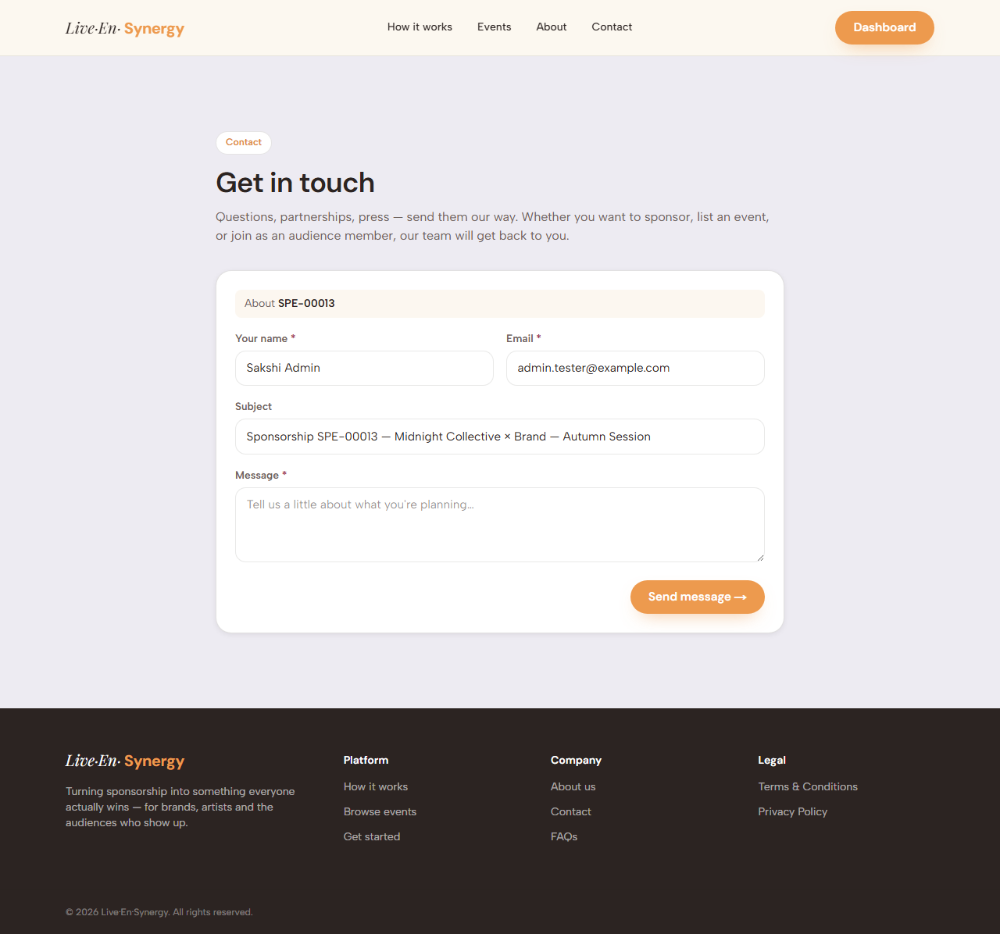

### 10 — Notifications quote their reference

**Files:** migration 0023 step 6 + follow-up, `dashboard/sponsored/actions.ts`,
`admin/marketplace-actions.ts`, `(marketing)/contact/actions.ts`.

**Remarks:** `renderTemplate` leaves an unresolved token **visible** as
`{{budget}}`, which is worse than the generic copy it replaces — so every token
has a real fallback at its call site. Two templates needed a second pass: 0017
had already rewritten them, so the "still seeded?" guard correctly skipped
them; they were matched against 0017's wording instead. All 28 rows (14 events
× in-app + email) now carry a reference.

| ID | Steps | Expected | Result |
|---|---|---|---|
| T10.1 | Submit feedback; Admin → Notifications. | "New feedback report FB-000NN" with reporter, kind and title. | ✅ `A6a-bell` |
| T10.2 | The reporter's own notifications. | "Feedback logged as FB-000NN". | ✅ |
| T10.3 | Create a campaign. | Brand's and admin's both quote `CMP-000NN`. | ✅ |
| T10.4 | Match it. | Names the campaign reference and the event. | ✅ |
| T10.5 | Confirm a sponsorship. | "Sponsorship SPE-000NN confirmed" with the budget. | ✅ template verified |
| T10.6 | A losing artist on a multi-suggestion campaign. | "Proposal SPE-000NN withdrawn", real reference. | ✅ via the 0023 RPC change |
| T10.7 | An event with **no** budget. | Reads "to be agreed", not `{{budget}}`. | ✅ by construction |
| T10.8 | Edit a template by hand, re-run the migration. | Your wording survives. | ✅ verified against `sponsorship.confirmed`, which 0017 had edited |
| T10.9 | Notification setup → a rewritten event. | Listed variables match what the template uses. | ✅ `A6b-template` |

### 11 — One person, several roles

**Files:** `onboarding/actions.ts`, migration 0023 step 1.

| ID | Steps | Expected | Result |
|---|---|---|---|
| T11.1 | Audience account on `+44 7700 900123`. | Saves. | ✅ |
| T11.2 | A **second audience** account, same number. | Rejected. | ✅ `phone_in_use` returns true — checked directly |
| T11.3 | `07700900123` on that second account. | Also rejected. | ✅ same key |
| T11.4 | An **artist** on `+44 7700 900123`. | **Saves.** | ✅ `R4-shared-number` |
| T11.5 | A **brand** on the same number. | Saves. | ✅ no check on that path |
| T11.6 | Two brand accounts on one manager phone. | Both save. | ✅ |
| T11.7 | Re-save the first audience profile unchanged. | Saves. | ✅ |
| T11.8 | Indexes after migrating. | Artists / organisers / brands ones gone. | ✅ confirmed — 0 of 3 remain |

---

## 4. Regression checks

| ID | Steps | Result |
|---|---|---|
| R1 | Sign in as brand / artist / admin / audience. | ✅ all four, every run |
| R2 | Audience overview and My events. | ✅ `U2-overview`, `U1c-my-events` |
| R3 | Brand ↔ artist messages send. | ✅ `D1c-thread`, `A3d-sent` |
| R4 | Admin enquiries, notifications, events, campaigns lists. | ✅ |
| R5 | Public `/contact` with and without `?ref=`. | ✅ `A7b-prefilled` |
| R6 | `npm run typecheck && npm run build`. | ✅ both clean |
| R7 | The pre-existing `artist` suite. | ✅ passes — after fixing **F7** |
| R8 | The pre-existing `brand` suite. | ✅ passes — after fixing **F7** |
| R9 | All six functional projects, one run, clean fixtures. | ✅ **67 passed, 2 skipped, 0 failed** |

---

## 5. Still open

| Item | Blocked on |
|---|---|
| **F1's API-level exposure** | The page-level leak is fixed, but the RLS policy still lets any signed-in user read another brand's confirmed sponsorship — budget columns included — straight from PostgREST. Closing it means column privileges or an audience-facing view that omits the money, the way `open_campaigns` hides campaign-manager contact details. Worth doing before launch. |
| `audience_members_phone_key` | Still doesn't exist. 0021 skipped it over duplicates; 0023 retries and reported two numbers still shared — `+44 7700 900123` (Priya Shah / Jordan Avery) and `+44 7775199436` (Abhishek Sharma / hivtroop music). Until they're resolved, audience phone uniqueness rests on the application check alone. Fix one of each pair, then re-run the `do $$ … audience_members_phone_key … $$` block. |
| **13 — Listings go live on payment** | The payment integration. Designed in `docs/payments-kyc-strategy.md` §5. |
| The £2.50 per-payout charge | Whether the sponsor's pool or the recipient absorbs it — it changes `netSponsorshipBudget()` and every "people this can sponsor" figure. |
| **F5** — campaigns with null manager fields | Your call: backfill `CMP-00001`'s three columns, or leave those campaigns un-editable until someone fills them in. |
| **F6** — `SUPABASE_SERVICE_ROLE_KEY` | Add to `.env.local` if you want `createConfirmedUser()` working. Nothing in `src/` needs it. |
| Full legal copy on `/terms` | Sakshi's drafting task, carried over from 3 Aug. |
| GitHub mirroring for feedback | `GITHUB_TOKEN` + `GITHUB_FEEDBACK_REPO` in Vercel. Carried over from 3 Aug. |
| **8 — GPS verification on QR scan** | Carried over from 3 Aug: Maps API key, radius decision, and somewhere to record event coordinates. |
| Branded email templates | Carried over from 3 Aug. |
